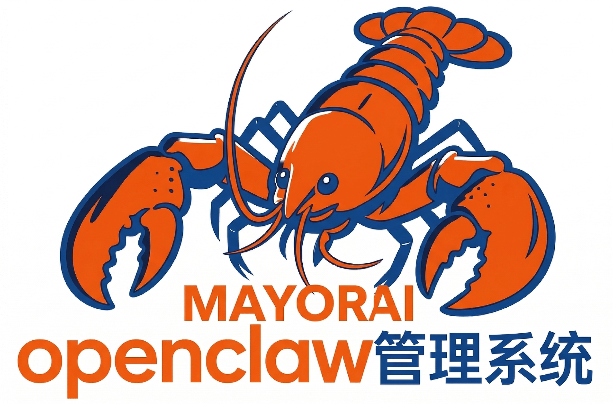

# 🦞 MaynorAIClawPanel 重磅发布！内置 AI 助手，一键管理 OpenClaw

## 还在为 OpenClaw 配置发愁？

**MaynorAIClawPanel** 来了！这是一款**内置智能 AI 助手**的 OpenClaw 管理面板，帮你：
- ✅ 一键安装 OpenClaw
- ✅ 自动诊断配置问题
- ✅ 智能排查错误
- ✅ 自动修复故障

---

## 🚀 核心亮点

### 1. 预设 AI 接口，开箱即用

内置 **MaynorAIPanel 公益接口**和 **MaynorAPIPro 专业接口**，支持 **23+ 最新 AI 模型**，一键配置即可使用！

### 2. AI 助手，能聊也能干

内置独立 AI 助手，不只是聊天机器人——**它能直接操作系统！**

**4 种操作模式：**

| 模式 | 说明 |
|------|------|
| 💬 聊天模式 | 纯问答，不触碰系统 |
| 📋 规划模式 | 读配置/查日志，输出方案不动文件 |
| ⚡ 执行模式 | 正常干活，危险操作弹确认 |
| ∞ 无限模式 | 全自动，工具调用不弹窗 |

**8 大工具：** 文件读写、命令执行、进程管理等

### 3. 多模态图片识别

粘贴截图或拖拽图片，AI 自动识别分析，支持图文混排对话！

### 4. 实时监控仪表盘

Gateway ���态、版本信息、Agent 数量、模型池、内网穿透、实时日志流，一目了然。

---

## 📦 下载安装

支持三大平台：

| 平台 | 支持版本 |
|------|---------|
| 🍎 macOS | Apple Silicon (M1/M2/M3/M4) + Intel |
| 🪟 Windows | Windows 10/11 |
| 🐧 Linux | AppImage / DEB / RPM |

👉 **[点击下载最新版本](https://introduce.tryopenclaw.asia/download.html)**

=

访问 http://localhost:1420，默认密码: 123456

---

## 📞 联系我们

🌐 官网：[www.tryopenclaw.asia](https://www.tryopenclaw.asia)

---

**MaynorAIClawPanel** — 让 AI 帮你管理 AI！

*许可证：CC BY-NC-SA 4.0 (仅限非商业用途)*
